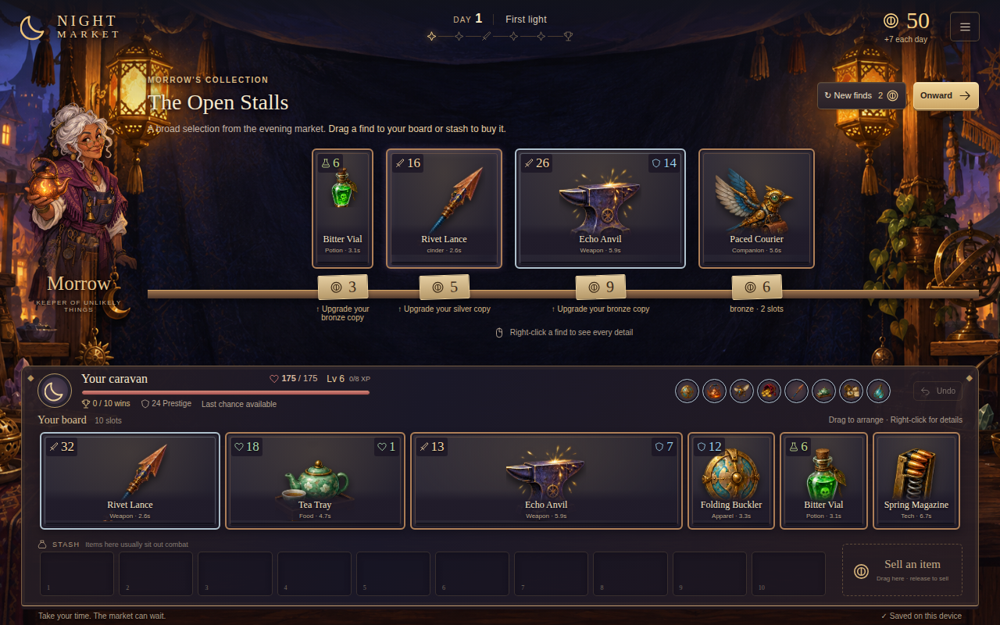

# Night Market

A private, local, desktop autobattler prototype. Build a board of original objects, shop between crossings, fight monsters and curated rivals, and try to earn ten wins. Decisions have no timer; combat is automatic.



The rules authority is [bazaar_mechanics_dossier.md](bazaar_mechanics_dossier.md). The supplied file is at the repository root, rather than the `outputs/` path in the implementation prompt. It has been preserved.

## Run

Requires Node.js 22.12+ and npm.

```sh
npm ci
npm run dev
```

Open the localhost URL printed by Vite. Designed for desktop viewports of 1280×800 and larger; 1440×900 is comfortable. All artwork ships locally. There are no accounts, services, or runtime network dependencies.

Choose a starting package. Each day has four market hours, one monster crossing at hour 3, and one rival crossing at hour 6. Income arrives at the next day's start. Ten rival wins end the run successfully; losses consume Prestige, followed by one last chance.

- Drag items between board and stash; the footprint shows exactly where they will land. Equal-size items swap. Drag shop finds onto a free footprint to buy, or onto the highlighted matching copy to upgrade. Drag owned items to the sell area, which shows the payout. Selling works outside shops too.
- Left-clicking an item does nothing. Right-click opens its detailed view, including current effects, enchantments, quests, calculated values and modifier sources. Tab then Shift+F10 is the keyboard inspection equivalent.
- Drag targeted rewards onto a highlighted recipient. Escape or right-click cancels a drag; invalid drops spend nothing. Ctrl/Cmd+Z or **Undo** reverses rearrangements. Purchases, sales and other decisions clear this history.
- Buying a duplicate upgrades the oldest eligible copy. Generated copies remain separate. Stash abilities only work where their individual definitions allow them.
- Monster/rival choices show their boards, skills and rewards before fighting; right-click their objects to inspect. Combat is hands-off. Space pauses; the timeline scrubs; controls change speed, step one event, jump to the next activation or skip to the result. Right-click details and the run menu pause playback, restoring its previous mode when closed.
- **Battle inspector** opens beside both boards and the playback controls. Search names, events or failure reasons; follow parent/child links, rolls, conditions, calculations and hashes. Turn off **Follow playback** (or scroll the transcript) to browse without losing your place.
- Every successful choice autosaves locally. The top-right menu contains **Resume**, save/build export and JSON import. Import accepts saves, combat snapshots and replays; imported snapshots can be fought in practice from a market-choice screen. Imported replays are recomputed and verified. Practice never changes your run.
- Saving a combat result preserves the outcome and pending continuation; the detailed replay is exported separately. Reloading a result does not regenerate its inspector history.

## Verification and tools

```sh
npm test                       # unit, integration, conformance and golden tests
npm run typecheck              # also compiles simulation with no DOM types
npm run lint
npm run build                  # production output in dist/
npm run preview                # serve the production build locally
npm run stress -- 10000        # 10,000 pairs, 20,000 actual simulations
npm run smoke                 # Chromium UI flow through a complete run
node --import tsx scripts/play-run.ts lantern-47  # normal command-only ten-win journey
npm run fixtures              # deliberately regenerate schemas, content JSON and golden fixtures
npm run format:check
```

The stress command compares both the event digest and final state hash for every pair, fails on a safety-limit error or divergence, and reports event/time bounds. It takes roughly 10–15 minutes on the implementation environment. The UI smoke test starts and closes its own server on port 4173 and writes screenshots under `artifacts/`. It uses installed Playwright Chromium or an existing Chromium cache. If needed, install it with `npx playwright install chromium`; alternatively set `PLAYWRIGHT_CHROMIUM_EXECUTABLE_PATH` to a compatible local executable.

Golden fixtures are reviewed expectations, not snapshots that tests update automatically. Regenerate them only after intentionally changing the rules, then inspect transcript differences.

## Architecture and scope

`packages/sim` is a framework-neutral TypeScript package. Validated, versioned JSON commands enter a reducer; state, serializable events, and hashes come back. It owns integer logical time, a deterministic queue, seeded named RNG streams, selectors, expressions, modifiers, and the shared item/skill ability evaluator. The DOM client handles board geometry, pointer gestures, menus and inspection; Phaser supplies combat effects. A drop stages validated commands and commits only if all succeed. Playback never advances the rules engine.

The catalog contains 29 original item definitions (28 normally obtainable plus a Legendary schema fixture), 8 skills, 9 encounters, and 40 curated monster/rival snapshots across five progression bands. Six standalone golden combats cover the main interactions and the extended meter/slot infrastructure. No hero system, custom resource network, crafting extension, networking, or backend is included.

The visual direction is an illustrated curiosity market: lanterns, indigo cloth, copper, a wooden worktable and original objects. See [visual direction and interaction contract](docs/visual-direction.md) and [art provenance](docs/art-prompts.md).

This is a tested systemic prototype with explicitly provisional rules, not a claim of exact live-game fidelity. The 40–60 minute run length is a tuning target, not a measured human playtest result. Start with [implementation status](docs/implementation-status.md), [architecture](docs/architecture.md), [rules decisions](docs/rules-decisions.md), [empirical validation](docs/empirical-validation.md), and [content authoring](docs/content-authoring.md).
